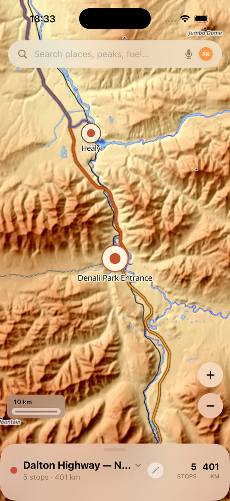
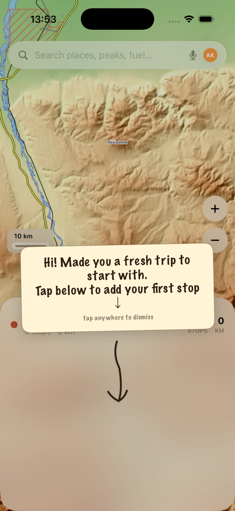
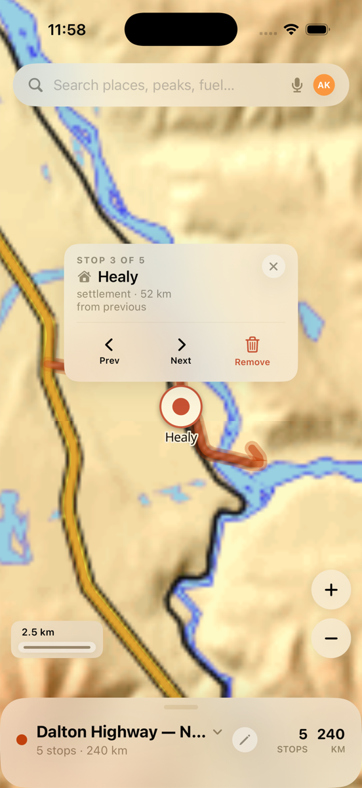
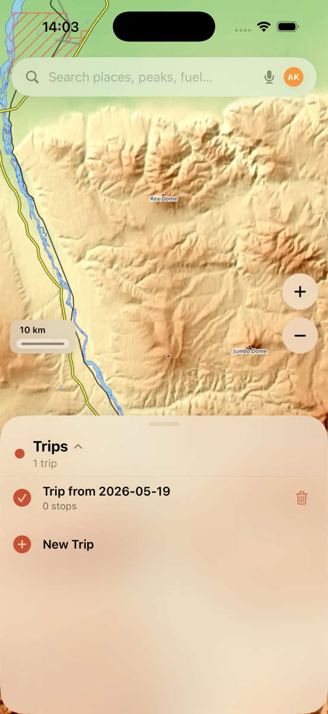
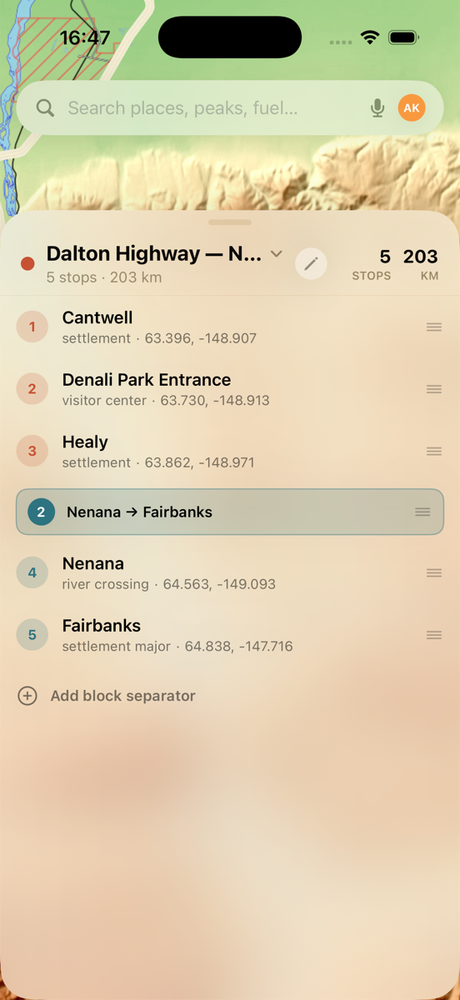
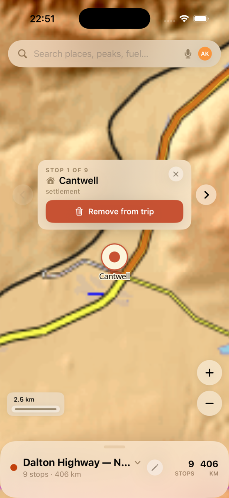
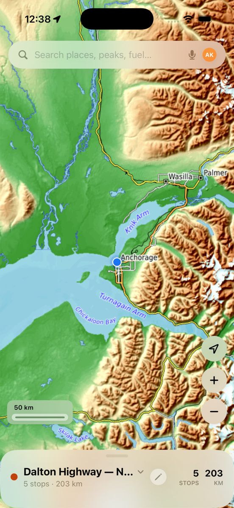

# AlaskaRouter

*A digital annotated atlas for expedition planning. Offline-first. iPhone.*

<p align="center">
  
</p>

## What it is

AlaskaRouter is a personal **expedition planning workspace** for iPhone — a place to lay out a multi-day trip on top of beautiful topographic terrain, drop stops along the way, split the route into days, see where you are right now, and trust that everything still works when there's no cell signal somewhere on the Dalton Highway.

It is not a turn-by-turn navigation app — when you actually want voice prompts to the next turn, you'll hand off to Apple Maps / Google Maps / Waze / OsmAnd / whatever feels right on the road.

## Why

I'm planning an Alaska trip, and nothing on the App Store quite fit what I wanted: the visual warmth of a paper atlas you'd find at a ranger station; offline-first by design rather than as a paid add-on; smart enough to know "I'm passing through here twice"; honest about being a *planner* rather than trying to be a one-app-fits-all.

So this is the planner I'd want as the person plotting the trip — the one you sit with at the kitchen table with a coffee, marking stops, adding little notes about fuel availability and weather windows, then carrying in your pocket as the actual trip unfolds.

Distribution path: personal use → open source → App Store.

## I believe

- **Offline-first is a feature, not a fallback.** Tile packs live in the app bundle. The route line falls back to a Catmull-Rom spline when OSRM isn't reachable, and snaps back to roads when the network returns.
- **The map should look like a place worth going.** Warm OpenTopoMap raster terrain. Translucent highlighter-style route line that you can see *through* — the road remains legible. Hand-drawn welcome notes. No flat tech-blue.
- **No subscriptions, ever.** Tile packs, search index, routing — everything you need ships with the app or is fetchable once.
- **Honest about what it is.** A planning tool that delegates navigation. Not a replacement for Apple Maps. Not a social platform. Not telemetry.
- **Built for one expedition at a time.** Start with the trip in front of you. Generalize later if other regions earn the work.

## Where we are

In active development, **entirely vibe-coded with [Claude Code](https://claude.com/claude-code)** — pair-programming session by session against this same repo. The first real-world dogfood will be an Alaska road trip; everything is being designed around that test.

Status: app builds and runs on iOS 26.5 simulator and device. Map, search, trip flow, multi-pass route rendering, locate-me, and most of v1 polish are in. License + OSS-readiness work is queued for v4+.

## Screenshots

<table>
  <tr>
    <td align="center">
      <br/>
      <sub>First-launch welcome (Marker Felt + hand-drawn arrow)</sub>
    </td>
    <td align="center">
      <br/>
      <sub>Stop callout — tap any marker on the map</sub>
    </td>
    <td align="center">
      <br/>
      <sub>Multi-trip switcher in the bottom sheet</sub>
    </td>
  </tr>
  <tr>
    <td align="center">
      <br/>
      <sub>Itinerary blocks (days / stretches) with per-block colors</sub>
    </td>
    <td align="center">
      <br/>
      <sub>Multi-pass route: same road twice = two ribbons</sub>
    </td>
    <td align="center">
      <br/>
      <sub>Locate me — Apple-Maps-style blue puck, zoom preserved</sub>
    </td>
  </tr>
</table>

## Stack

- **[MapLibre Native iOS](https://github.com/maplibre/maplibre-native)** + **[MapLibreSwiftUI DSL](https://github.com/maplibre/swiftui-dsl)** — vector / raster map rendering, SwiftUI-friendly
- **[Protomaps PMTiles](https://protomaps.com/docs/pmtiles)** — single-file tile archive served directly from the app bundle, no tile server needed
- **[OpenTopoMap](https://opentopomap.org)** raster basemap (CC-BY-SA) — the visual identity. World skeleton at z=0–5 + Alaska statewide at z=6–10, bundled offline.
- **[OSRM](http://project-osrm.org)** public router — snap-to-road geometry at trip-plan time, cached per segment
- **SwiftData** — local-only persistence (Trip, Waypoint, BlockSeparator)
- **SQLite FTS5** — 12 k Alaska places, two-stage retrieval with prefix match + Levenshtein rerank, sub-millisecond queries
- **CoreLocation** — GPS for locate-me; no tracking, no telemetry
- **xcodegen** — `project.yml` is the source of truth; the `.xcodeproj` is generated and gitignored
- **iOS 26.5 / Swift 6 / Xcode 26.5** — latest-only, no backwards compat

## Build & run

You'll need: macOS with Xcode 26.5+, [Homebrew](https://brew.sh), [xcodegen](https://github.com/yonaskolb/XcodeGen), and a few command-line tools.

```bash
# one-time setup
brew install xcodegen gh jq pmtiles

# clone + fetch the offline tile pack (~447 MB, from a GitHub Release)
git clone git@github.com:limar/AlaskaRouter.git
cd AlaskaRouter
tools/build-pack/fetch-pack.sh

# generate the Xcode project + open
xcodegen generate
open AlaskaRouter.xcodeproj
```

Then ⌘R in Xcode. The first launch creates an empty trip and shows a one-time welcome card.

To simulate being somewhere in Alaska (for locate-me testing):

```bash
xcrun simctl privacy booted grant location dev.alaskarouter.AlaskaRouter
xcrun simctl location  booted set 63.86,-148.97   # Healy, AK
```

If you'd rather regenerate the tile pack from scratch (≈2 hours of polite scraping from OpenTopoMap), see [`tools/build-pack/README.md`](tools/build-pack/README.md).

## Roadmap

Milestones tracked in the [`.beans/`](#task-tracking) directory.

- **v1 — Personal Alaska trip** *(in progress)*
  Map polish ✓, trip flow ✓, multi-trip switcher ✓, search ✓, add / delete / select stops ✓, itinerary blocks ✓, multi-pass route ✓, locate me ✓. Remaining: zoom-out label tuning, map legend, universal landmark clickability, group search highlight, on-map reorder UX, warmer Prev / Next buttons.

- **v2 — Glamorous** *(todo)*
  Annotations (notes, photos, sketches placed on the map). Real offline routing (Valhalla or equivalent). iCloud Drive regional tile packs with multi-region search. Paper-atlas visual polish (stippled forests, hand-drawn place markers).

- **v3 — Atmospheric** *(todo)*
  Rare, gentle animations to make the map feel alive: wind in the forests, the occasional animal or bird, weather over the mountains. The architectural hooks in v1/v2 are designed not to foreclose this.

- **v4+ — Distribution** *(deferred)*
  App Store submission (privacy policy, screenshots, etc.). OSS public release (LICENSE, CONTRIBUTING, CI). Git-LFS or equivalent strategy if tile-pack download flow needs to scale.

## Task tracking

This repo uses **[beans](https://github.com/sungkyu-co/beans)** — a markdown-file issue tracker. Tasks ("beans") live in [`.beans/`](.beans/) next to the code, version-controlled, agentic-friendly. Each bean has a stable ID like `AlaskaRouter-amh7` referenced in commit messages.

To browse the current backlog: `beans list --ready` (after `brew install beans`).

## Acknowledgments

- **[OpenStreetMap](https://www.openstreetmap.org/copyright)** contributors — the underlying geographic data (ODbL).
- **[OpenTopoMap](https://opentopomap.org)** — the gorgeous topographic raster style (CC-BY-SA), built on top of OSM + SRTM.
- **[Protomaps](https://protomaps.com)** — the PMTiles format and reference tooling that made offline tile bundling practical.
- **[MapLibre](https://maplibre.org)** community — both the native iOS SDK and the SwiftUI DSL on top of it.
- **[OSRM](http://project-osrm.org)** — public routing endpoint generously available for trip-planning use.
- **[Noto Sans](https://fonts.google.com/noto/specimen/Noto+Sans)** — bundled glyphs for offline label rendering.
- **Claude Code** — the pair-programming partner that made this much code possible from a single human's hours.

## License

License is **not yet chosen**. The repo is public for visibility but is not yet open-source-licensed; treat the code as *all rights reserved* until that changes. License selection is tracked as part of the v4+ OSS-readiness work — likely MIT or Apache-2.0.
